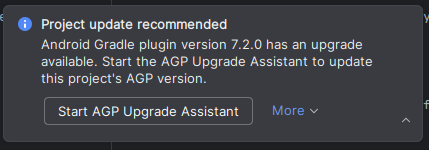
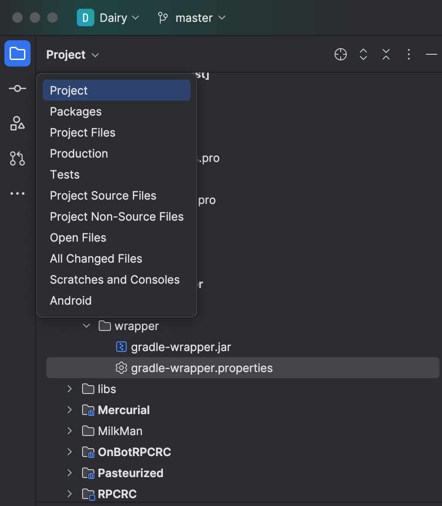

# Don't upgrade the Gradle version or Android Gradle Plugin version

> Consider checking out [our article on alternate project
> setups](../project_templates/project_templates.md)

Android studio loves to tempt you with this little pop up, prompting you to
upgrade the Android Gradle Plugin (AGP).

You need to click on [More] > Don't show again for this project. This will
prevent the issue from occurring again.

These upgrades are not productive, and interfere with the current gradle build,
even if you get it working on your computer, it may cause issues with team
member's computers, and it makes it harder to upgrade the SDK when a new version
releases. Additionally, it may cause issues when working with other gradle
operations, like adding libraries.

If you accidentally upgrade the AGP or the Gradle version, you should hopefully
be able to use git to undo the change, or, you can override those files with
ones from the SDK.

It may be possible to undo the changes more simply by downgrading again.

The AGP version should be `7.2.0`. It is set in the project root `build.gradle`.

The Gradle version should be `7.4.2`. It is set in `gradle/wrapper/gradle-wrapper.properties`.

It may be easier to find these files with the file explorer set to `Project`
mode, rather than `Android` mode.

